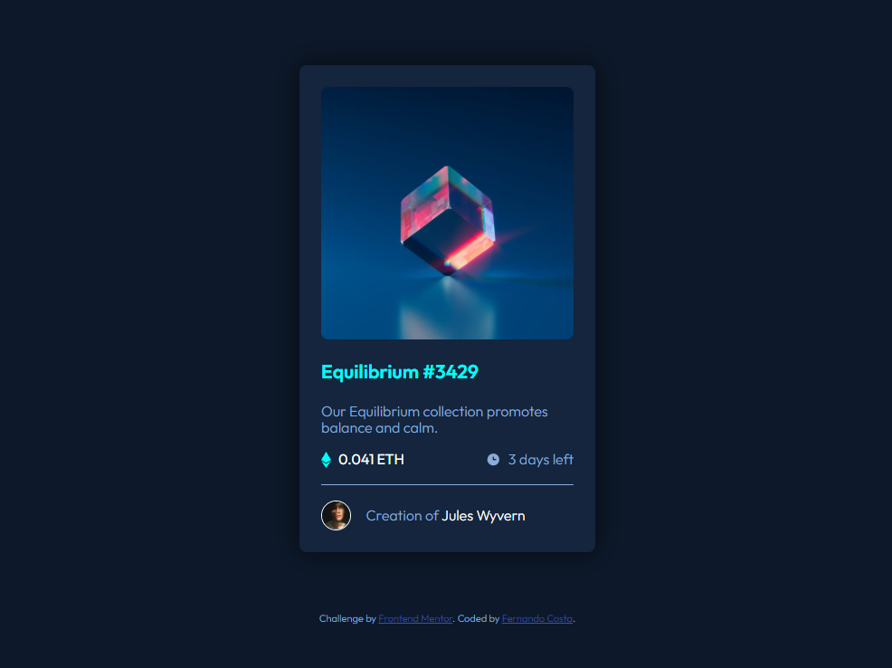

# Frontend Mentor - NFT preview card component solution

This is a solution to the [NFT preview card component challenge on Frontend Mentor](https://www.frontendmentor.io/challenges/nft-preview-card-component-SbdUL_w0U). Frontend Mentor challenges help you improve your coding skills by building realistic projects. 

## Table of contents

- [Overview](#overview)
  - [The challenge](#the-challenge)
  - [Screenshot](#screenshot)
  - [Links](#links)
- [My process](#my-process)
  - [Built with](#built-with)
  - [What I learned](#what-i-learned)
  - [Continued development](#continued-development)
- [Author](#author)

## Overview

### The challenge

Users should be able to:

- View the optimal layout depending on their device's screen size
- See hover states for interactive elements

### Screenshot




### Links

- [My solution](https://github.com/ffernandocosta/nft-preview-card-component-main)
- [Live sersion](https://ffernandocosta.github.io/nft-preview-card-component-main/)

## My process

### Built with

- Semantic HTML5 markup
- CSS custom properties
- Flexbox
- CSS Grid
- Mobile-first workflow


### What I learned

In this project I learned how to create hover effects using position relative, absolut and transform and also using an svg icon to match the design asked in this challenge. I also got to practice the use of variables in my css.

```html
<h1>Some HTML code I'm proud of</h1>
  <div class="product__img-container">
    <a href="#"></a>
      <div class="img__overlay">
          
      </div>
  </div>
```
```css
.proud-of-this-css {
  
  .product__img-container {
    overflow: hidden;
    position: relative;
}

.product__img {
    border-radius: 0.5rem;
}

.img__overlay {
    position: absolute;
    left: 0;
    top: 0;
    width: 100%;
    height: 100%;
    border-radius: 0.5rem;
    background-color: hsla(178, 100%, 50%, 0.5);
    display: none;
}

.img__overlay img {
    position: absolute;
    width: 48px;
    height: 48px;
    left: 50%;
    top: 50%;
    transform: translate(-50%, -50%);
}

.product__img-container:hover .img__overlay {
    display: block;
    cursor: pointer;
}
}
```

### Continued development

I want to tackle more complex projects in the future and hopefully use some of JavaScript as well.


## Author

- GitHub - [Fernando Costa](https://github.com/ffernandocosta)